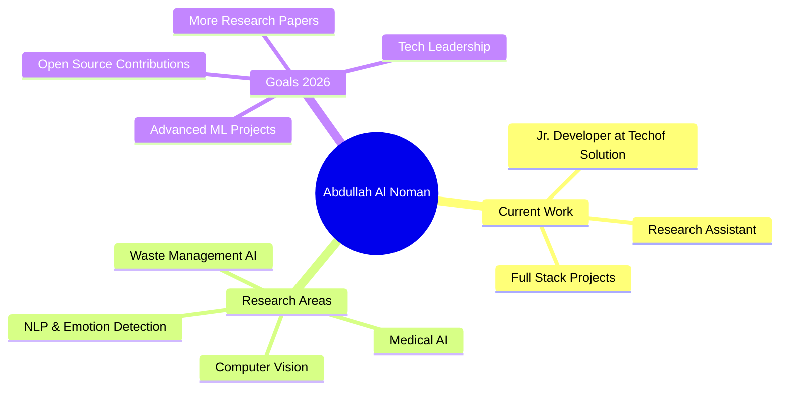
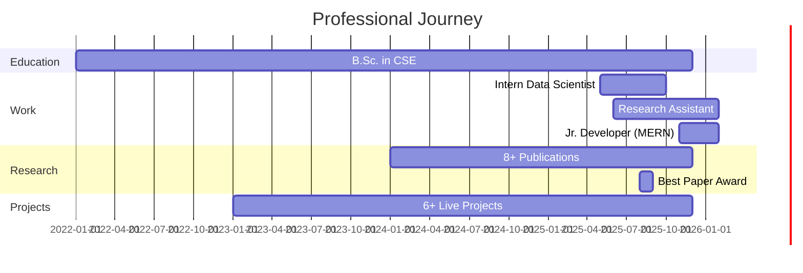

<div align="center">


</div>

<div align="center">

[](https://git.io/typing-svg)

</div>

<div align="center">

[](https://github.com/AbdullahAlNoman20)
[](https://www.linkedin.com/in/abdullah-al-noman-khu/)
[](mailto:abdullahalnoman.abn0@gmail.com)
[](https://github.com/AbdullahAlNoman20)
[](tel:+8801764308876)

</div>

---

## 🎓 Recent Graduate & Professional Developer

<div align="center">

### **Proudly Graduated with B.Sc. in Computer Science & Engineering**
**Daffodil International University** | Class of 2025

</div>


### 👨‍💻 About Me

I am **Abdullah Al Noman**, a passionate **Full-Stack Developer** and **Machine Learning Engineer** who recently graduated from Daffodil International University with a degree in Computer Science & Engineering. With hands-on experience in **MERN Stack**, **AI/ML technologies**, and **research**, I specialize in building scalable web applications and implementing cutting-edge artificial intelligence solutions.

🔹 **6+ Live Full-Stack Projects** deployed and running in production  
🔹 **8+ Research Papers** published in international conferences  
🔹 **Best Paper Award** winner at BIM 2025  
🔹 Currently working as **Jr. Developer (MERN)** at Techof Solution Ltd.  
🔹 **Research Assistant** in medical AI at Bangladesh Medical University

### 🎯 Quick Highlights

```javascript
const abdullah = {
    location: "Ashulia, Dhaka, Bangladesh",
    education: "B.Sc. in CSE (Graduated 2025)",
    currentRole: "Jr. Developer (MERN) @ Techof Solution Ltd.",
    researchRole: "Research Assistant @ Bangladesh Medical University",
    specialization: ["Full Stack Development", "Machine Learning", "AI Research"],
    liveProjects: 6,
    publications: 8,
    awards: ["Best Paper Award at BIM 2025"],
    passions: ["Innovation", "Problem Solving", "Continuous Learning"]
};
```

---

## 💼 Professional Experience

<div align="center">

| Role | Organization | Duration | Focus Area |
|------|-------------|----------|------------|
| 🔷 **Jr. Developer (MERN)** | Techof Solution Ltd. | Nov 2025 - Present | Full Stack Development |
| 🔬 **Research Assistant** | Bangladesh Medical University | Jun 2025 - Present | Medical AI & ML |
| 📊 **Intern Data Scientist** | Data Solution 360 | May 2025 - Oct 2025 | Data Science & ML |

</div>

### 🌟 Key Achievements

```diff
+ Successfully completed 6+ production-ready full-stack web applications
+ Published 8+ research papers in international conferences
+ Won Best Paper Award at BIM 2025 for BanglaMind AI Chatbot
+ Led full-stack development of Schedule Solutions BPO platform
+ Developed Bangladeshi car number plate detection system using YOLOv8
```

---

## 🛠️ Tech Stack & Professional Skills

<div align="center">

### 💻 Programming Languages


### 🌐 Web Development


### 🤖 AI/ML & Data Science


### 🗄️ Databases


### 📱 Mobile Development


### 🔧 Tools & Technologies


</div>

### 🎯 Professional Competencies

<div align="center">

| Technical Skills | Soft Skills |
|:---------------:|:-----------:|
| Deep Learning & Machine Learning | Leadership & Team Management |
| Natural Language Processing (NLP) | Time Management |
| YOLO Object Detection | Presentation Skills |
| OOP & Algorithms | Sales & Marketing |
| Video Editing | Problem Solving |

</div>

---

## 🏆 Featured Projects

### 🌐 Schedule Solutions - Business Process Outsourcing Platform
**Role:** Lead Full Stack Developer  
**Tech Stack:** MERN (MongoDB, Express.js, React.js, Node.js)

```yaml
Features:
  - Full-stack web application with responsive UI/UX
  - Seamless frontend-backend integration
  - Performance optimization and SEO implementation
  - Currently live and serving clients
```

🔗 [View Project](https://schedule-solutions.vercel.app/)

---

### 🚗 Bangladeshi Car Number Plate Detection
**Role:** Machine Learning Engineer  
**Tech Stack:** Python, YOLO, OpenCV, Scikit-learn

```yaml
Capabilities:
  - Real-time vehicle number plate detection
  - Support for both Bangla and English plates
  - Computer vision with YOLOv8
  - Data analysis with NumPy, Pandas, Matplotlib
```

🔗 [View Project](https://github.com/AbdullahAlNoman20/Bangladeshi-Car-Number-Plate-Detection)

---

## 📚 Research Publications & Awards

<div align="center">

### 🏅 Best Paper Award Winner

</div>

<details>
<summary><b>🔬 BanglaMind: AI-Powered Chatbot for Emotion and Suicide Risk Detection (2025)</b> 🏆 BEST PAPER AWARD</summary>

**Conference:** 3rd International Conference on Big Data, IoT, and Machine Learning (BIM 2025)

**Achievement:** Won the **Best Paper Award** at BIM 2025

**Focus:** AI-powered mental health support system for students using NLP and emotion detection

🔗 [Read Paper](https://link.springer.com/chapter/10.1007/978-981-97-9793-6_27)

</details>

<details>
<summary><b>🚗 BanglaPlate: Automated Vehicle Number Plate Detection and Recognition using YOLOv8 (2025)</b></summary>

**Conference:** 4th International Conference on Electrical, Computer and Communication Engineering (ECCE 2025)

**Focus:** Advanced computer vision system for automated vehicle identification in Bangladesh

🔗 [Read Paper](https://ieeexplore.ieee.org/document/10830260)

</details>

<details>
<summary><b>♻️ Automated Effective Waste Classification and Sorting using YOLOv8 (2025)</b></summary>

**Conference:** 2025 International Conference on Quantum Photonics, Artificial Intelligence, and Networking (QPAIN)

**Focus:** Sustainable waste management using AI and IoT technologies

🔗 [Read Paper](https://ieeexplore.ieee.org/document/10825892/)

</details>

**Total Publications:** 8+ research papers published in international conferences

---

## 📜 Certifications & Training

<div align="center">

| 🎓 Certification | 🏢 Institution | 📅 Year | 🎯 Focus |
|:----------------|:--------------|:-------:|:---------|
| **Complete Web Development** | Programming Hero (Batch 9) | 2024 | MERN Stack Development |
| **Data Science and Machine Learning** | Data Solution 360 (Batch 1) | 2025 | AI/ML & Data Analysis |
| **The Fundamentals of Digital Marketing** | Google | 2021 | Digital Marketing |

</div>

### 🎯 Continuous Learning Platforms

<div align="center">


**Active Learning:** Udemy • Khalid Farhan Academy • GhooriLearning • Simply Learn • Google Colab

</div>

---

## 📊 GitHub Statistics & Analytics

<div align="center">


</div>

<div align="center">


</div>

<div align="center">

### 🏆 GitHub Trophies

[](https://github.com/ryo-ma/github-profile-trophy)

</div>

### 📈 Contribution Graph

<div align="center">

[](https://github.com/AbdullahAlNoman20)

</div>

### 💻 Most Used Languages

<div align="center">


</div>

---

## 🎯 Current Focus & Future Goals

<div align="center">



</div>

### 🔭 Currently Working On
- 🤖 Advanced Machine Learning and AI projects
- ♻️ Automated Waste Detection using YOLOv11 and IoT
- 💼 Full-stack web applications at Techof Solution Ltd.
- 🏥 Medical AI research at Bangladesh Medical University

### 🌱 Currently Learning
- Advanced Deep Learning architectures
- Cloud computing and DevOps
- Advanced data structures and algorithms
- System design and architecture

### 👯 Open to Collaborate On
- Research projects in AI/ML
- Full-stack web applications
- Open-source contributions
- Innovative tech solutions

---

## 🌐 Connect With Me

<div align="center">

[](https://github.com/AbdullahAlNoman20)
[](https://www.linkedin.com/in/abdullah-al-noman-khu/)
[](https://www.facebook.com/abdullahanoman07/)
[](https://www.instagram.com/a.n.1.0/)
[](https://www.youtube.com/@AbdullahAlNoman./featured)
[](mailto:abdullahalnoman.abn0@gmail.com)
[](https://wa.me/8801764308876)

</div>

---

## 💡 Skills Visualization

<div align="center">

### Programming Proficiency

```text
JavaScript   ████████████████████░   95%
Python       ███████████████████░░   90%
React.js     ████████████████████░   95%
Node.js      ███████████████████░░   90%
MongoDB      ██████████████████░░░   85%
Machine Learning ████████████████░░░░   80%
Deep Learning    ███████████████░░░░░   75%
```

</div>

---

## 🎨 Highlights & Achievements Timeline



---

## 📞 Get In Touch

<div align="center">

### 💬 I'm always open to interesting conversations and collaboration opportunities!

**📧 Email:** [abdullahalnoman.abn0@gmail.com](mailto:abdullahalnoman.abn0@gmail.com)  
**📱 Phone:** +880 1764 308876  
**📍 Location:** Ashulia, Dhaka, Bangladesh


</div>

<div align="center">

### 💭 "Innovation distinguishes between a leader and a follower." - Steve Jobs

**Open to Full-Time Opportunities | Freelance Projects | Research Collaborations** 🚀

---

⭐ **If you find my work interesting, consider giving my repositories a star!** ⭐


**Last Updated:** February 2026

</div>